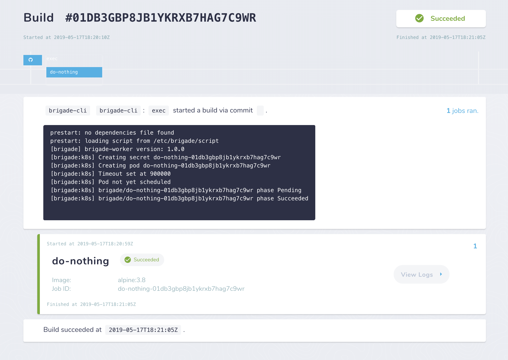

# Getting started with Brigade

First, we deploy Brigade in our cluster:

```
$ helm repo add brigade https://brigadecore.github.io/charts
"brigade" has been added to your repositories
$ helm install brigade/brigade --name brigade --namespace brigade
```

At this point, we set the default namespace for `brig`, the Brigade CLI, by exporting an environment variable, and check that everything is working properly:

```
$ export BRIGADE_NAMESPACE=brigade
$ brig check
Brigade API Server replicas: Desired 1, Ready 1, Updated 1, Available 1, Unavailable 0
Brigade Controller replicas: Desired 1, Ready 1, Updated 1, Available 1, Unavailable 0
Kashti replicas: Desired 1, Ready 1, Updated 1, Available 1, Unavailable 0
Info: Vacuum is healthy (not suspended and its schedule is non-empty)
```

Now let's create a new project.

> Right now, `brig` initially assumes the project you are creating has a Git repository associated - however, that is not always the case and we can configure a Brigade project to work without one. [This pull request](https://github.com/brigadecore/brigade/pull/892) makes it way easier to create projects without a repository. But until a new version of Brigade is released, we can set the `VCS Sidecar` property to `NONE` when creating the project.

```
$ brig project create
? Project Name brigadecore/hello-kubecon
? Full repository name github.com/brigadecore/hello-kubecon
? Clone URL (https://github.com/your/repo.git) https://github.com/brigadecore/hello-kubecon.git
? Add secrets? No
Auto-generated a Shared Secret: "7vr1h9PIksCKjywFr92eXOfM"
? Configure GitHub Access? No
? Configure advanced options Yes
? Custom VCS sidecar (enter 'NONE' for no sidecar) NONE
? Build storage size
? SecretKeyRef usage No
? Project Service Account
? Build storage class hostpath
? Job cache storage class hostpath
? Worker image registry or DockerHub org
? Worker image name
? Custom worker image tag
? Worker image pull policy IfNotPresent
? Worker command yarn -s start
? Initialize Git submodules No
? Allow host mounts No
? Allow privileged jobs No
? Image pull secrets
? Default script ConfigMap name
? brigade.js file path relative to the repository root
? Upload a default brigade.js script
? Secret for the Generic Gateway (alphanumeric characters only). Press Enter if you want it to be auto-generated
Auto-generated Generic Gateway Secret: Q7nRP
Project ID: brigade-2e3c1b01f9fcffe9b41433319a52d12cfccd8f148c5a6374f00cb4
```

Now let's check the project:

```
$ brig project list
NAME                            ID                                                              REPO
brigadecore/hello-kubecon       brigade-2e3c1b01f9fcffe9b41433319a52d12cfccd8f148c5a6374f00cb4  github.com/brigadecore/hello-kubecon
```

Now let's create and run a simple pipeline - save the following as `hello.js`.

```javascript
const { events, Job } = require("brigadier");

events.on("exec", () => {
  var job = new Job("do-nothing", "alpine:3.8");
  job.tasks = ["echo Hello", "echo World"];

  job.run();
});
```

Now we will use `brig` to schedule a pipeline that will run our job:

```
$ brig run -f hello.js brigade-2e3c1b01f9fcffe9b41433319a52d12cfccd8f148c5a6374f00cb4
Event created. Waiting for worker pod named "brigade-worker-01db3gbp8jb1ykrxb7hag7c9wr".
Build: 01db3gbp8jb1ykrxb7hag7c9wr, Worker: brigade-worker-01db3gbp8jb1ykrxb7hag7c9wr
prestart: no dependencies file found
prestart: loading script from /etc/brigade/script
[brigade] brigade-worker version: 1.0.0
[brigade:k8s] Creating secret do-nothing-01db3gbp8jb1ykrxb7hag7c9wr
[brigade:k8s] Creating pod do-nothing-01db3gbp8jb1ykrxb7hag7c9wr
[brigade:k8s] Timeout set at 900000
[brigade:k8s] Pod not yet scheduled
[brigade:k8s] brigade/do-nothing-01db3gbp8jb1ykrxb7hag7c9wr phase Pending
[brigade:k8s] brigade/do-nothing-01db3gbp8jb1ykrxb7hag7c9wr phase Succeeded

$ brig build logs --last --jobs

==========[  brigade-worker-01db3gbp8jb1ykrxb7hag7c9wr  ]==========
prestart: no dependencies file found
prestart: loading script from /etc/brigade/script
[brigade] brigade-worker version: 1.0.0
[brigade:k8s] Creating secret do-nothing-01db3gbp8jb1ykrxb7hag7c9wr
[brigade:k8s] Creating pod do-nothing-01db3gbp8jb1ykrxb7hag7c9wr
[brigade:k8s] Timeout set at 900000
[brigade:k8s] Pod not yet scheduled
[brigade:k8s] brigade/do-nothing-01db3gbp8jb1ykrxb7hag7c9wr phase Pending
[brigade:k8s] brigade/do-nothing-01db3gbp8jb1ykrxb7hag7c9wr phase Succeeded

==========[  do-nothing-01db3gbp8jb1ykrxb7hag7c9wr  ]==========
Hello
World
```

> You can [follow this guide](https://docs.brigade.sh/intro/quickstart/#using-brigade-with-generic-gateway-no-version-control-system) to also see how to use the generic gateway for Brigade.

You can also see all the builds and logs by using `brig dashboard`:




At this point, it is strongly recommended you [follow the Brigade scripting guide from the official documentation](https://docs.brigade.sh/topics/scripting/), followed by the [advanced scripting guide](https://docs.brigade.sh/topics/scripting_advanced/).
